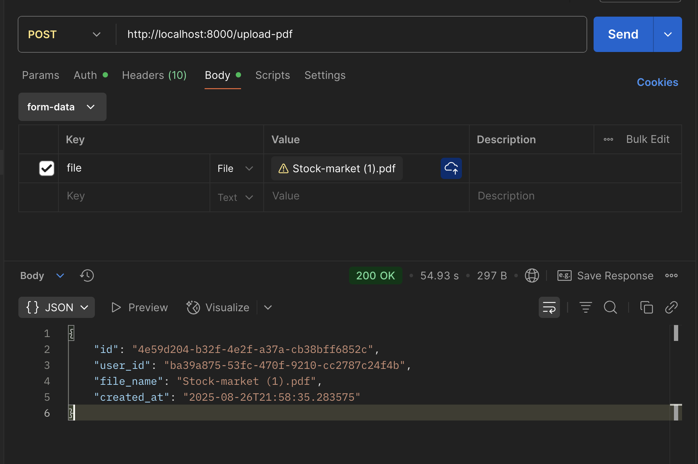

# ☁️ AWS / Cloud Services for Deployment
For deploying this PDF search backend, a robust and scalable set of AWS services would be ideal:

- **Backend API:**
  - **AWS EC2 Machine:** For hosting the backend API.

- **Database (Postgres):**
  - **AWS RDS (Relational Database Service):** Managed PostgreSQL database.

- **Search (Elasticsearch):**
  - **AWS OpenSearch Service:** Managed OpenSearch (Elasticsearch) service.

- **Asynchronous Processing:**
  - **AWS SQS (Simple Queue Service):** Api will use SQS to queue PDF processing tasks, worker will pick up tasks from the queue.
  - **AWS Lambda:** Serverless functions to process PDFs. This will download the pdf from S3, perform extraction, embedding and indexing in OpenSearch.
  - **AWS S3:** Storage for uploaded PDFs and processed results.

# 🚀 Workflow: PDF Upload & Search
**1. Get Access 🔑:** First, you **register** and **login** to get a secure access token (JWT). You'll need this token for most actions.

**2. Upload PDF ⬆️:** You **upload** a PDF file to the app. The backend then:
 - ***Extracts everything*** from the PDF: text, tables (formatted into searchable strings), and even text from images (using OCR).

 - ***Creates embeddings*** for all this content.

 - ***Stores the content*** in Elasticsearch for fast searching and saves the PDF's details in PostgreSQL.

**3. Search Your PDFs 🔍:** You can now search by typing a query. The app uses your query's embeddings to find the most relevant pieces of content across all your uploaded PDFs.

**4. Manage Your Files 📂:** You can also easily view a list of all the PDFs you've uploaded.

# 🚀 Technologies Used
- Backend Framework: FastAPI (Python)

- Database: PostgreSQL (with SQLAlchemy ORM)

- Search Engine: Elasticsearch

- Vector Embeddings: sentence-transformers

- PDF Parsing: PyMuPDF

- OCR: PyTesseract (requires Tesseract-OCR engine)

- Containerization: Docker

# 🚀 Project Setup Locally

## 1. Using Docker (Recommended)

- Clone the repository using Git
    ```sh
    git clone https://github.com/niteshjangid29/pdf-search.git
    cd pdf-search
    ```

- Build the Docker image of the project (in root of the project)
    ```sh
    docker build -t pdf-search .
    ```

- Run the Docker container
    ```sh
    docker run -p 8000:8000 pdf-search
    ```

## 2. Setup without Docker
- Clone the repository
    ```sh
    git clone https://github.com/niteshjangid29/pdf-search.git
    cd pdf-search
    ```

- Create the virtual environment
    ```sh
    python3 -m venv venv
    source venv/bin/activate
    ```

- Install Dependencies
    ```sh
    pip install -r requirements.txt
    ```

- Run the Application
    ```sh
    uvicorn main:app --reload --port 8000
    ```

**Note:** This may additionally require to install `PyTesseract` for image-ocr

### Lets go!
The project is now set up and running! You can start using the PDF search API at [http://localhost:8000](http://localhost:8000)
```sh
http://localhost:8000
```

# API Endpoints

This document provides a detailed overview of the API endpoints for the PDF Semantic Search application. All API endpoints are available under the main application URL.

---

## Authentication Endpoints

This section covers endpoints related to user registration, login, and profile management.

### 1. Register a New User

- **Endpoint:** `POST /register`
- **Description:** Creates a new user account.
- **Authorization:** None required.

Request Body:
```json
{
  "fullname": "Nitesh Jangid",
  "email": "nitesh@gmail.com",
  "password": "nitesh123"
}
```

Success Response (200 OK):

```json
{
    "email": "hitendra@gmail.com",
    "fullname": "Hitendra",
    "id": "ba39a875-53fc-470f-9210-cc2787c24f4b",
    "created_at": "2025-08-26T14:44:15.284624"
}
```

### 2. User Login
- **Endpoint:** POST `/login`
- **Description:** Authenticates a user and returns a JWT access token.
- **Authorization:** None required.

Request Body:
```json
{
  "email": "nitesh@gmail.com",
  "password": "nitesh123"
}
```

Success Response (200 OK):

```json
{
  "access_token": "ey...",
  "token_type": "bearer"
}
```

### 3. Get User Profile
- **Endpoint:** GET `/profile`
- **Description:** Retrieves the profile information of the currently authenticated user.
- **Authorization:** *Bearer Token* required.

Success Response (200 OK):
```json
{
    "email": "hitendra@gmail.com",
    "fullname": "Hitendra",
    "id": "ba39a875-53fc-470f-9210-cc2787c24f4b",
    "created_at": "2025-08-26T14:44:15.284624"
}
```

## PDF Management Endpoints
These endpoints are for uploading, searching, and managing PDF documents. All endpoints in this section require authentication.

**Authorization Header**
For all protected routes, you must include the JWT token in the Authorization header:
```
Authorization: Bearer <your_access_token>
```

### 1. Upload a PDF
- **Endpoint:** POST `/upload-pdf`
- **Description:** Uploads a PDF file. The system processes the file, extracts its content, creates vector embeddings, and indexes it for searching.
- **Authorization:** Bearer Token required.

Request Body:
- This is a multipart/form-data request. The file should be sent under the key `file`.

<!-- upload an image -->


Success Response (200 OK):

Returns the metadata of the newly created PDF record.
```json
{
    "id": "4e59d204-b32f-4e2f-a37a-cb38bff6852c",
    "user_id": "ba39a875-53fc-470f-9210-cc2787c24f4b",
    "file_name": "Stock-market (1).pdf",
    "created_at": "2025-08-26T21:58:35.283575"
}
```

**Note:** `id` of the pdf is required in searching, so copy that.

### 2. Search Within a PDF
- **Endpoint:** POST `/search`
- **Description:** Performs a semantic search for a query string within a specific PDF document.
- **Return:** Return top 5 search results
- **Authorization:** Bearer Token required.

Request Body:
```json
{
    "query": "Stock Market",
    "pdf_id": "4e59d204-b32f-4e2f-a37a-cb38bff6852c"
}
```

Success Response (200 OK):

```
[
    {
        "pdf_id": "4e59d204-b32f-4e2f-a37a-cb38bff6852c",
        "type": "text",
        "page_number": 1,
        "block_index": 2,
        "content": "How the Stock Market Works"
    },
    {
        "pdf_id": "4e59d204-b32f-4e2f-a37a-cb38bff6852c",
        "type": "text",
        "page_number": 3,
        "block_index": 2,
        "content": "Stock Market Analysis"
    },
    {
        "pdf_id": "4e59d204-b32f-4e2f-a37a-cb38bff6852c",
        "type": "text",
        "page_number": 0,
        "block_index": 2,
        "content": "An Introduction to the Stock Market"
    },
    {
        "pdf_id": "4e59d204-b32f-4e2f-a37a-cb38bff6852c",
        "type": "text",
        "page_number": 0,
        "block_index": 3,
        "content": "The stock market refers to the collection of markets and exchanges where the issuing and \ntrading of shares of publicly-held companies take place. It's a cornerstone of modern capitalism, \nproviding a platform for companies to raise capital for growth and for investors to own a piece of \nthose companies and share in their potential profits. At its core, the stock market is a dynamic \nenvironment where the ownership of corporations is bought and sold, driven by the collective \nassessment of their current and future value."
    },
    {
        "pdf_id": "4e59d204-b32f-4e2f-a37a-cb38bff6852c",
        "type": "text",
        "page_number": 3,
        "block_index": 0,
        "content": "Value \nStocks"
    }
]
```

### 3. Get All User Documents
- **Endpoint:** GET `/pdfs`
- **Description:** Retrieves a list of metadata for all PDF documents uploaded by the authenticated user.
- **Authorization:** Bearer Token required.

Success Response (200 OK):
```
[
    {
        "id": "4e59d204-b32f-4e2f-a37a-cb38bff6852c",
        "user_id": "ba39a875-53fc-470f-9210-cc2787c24f4b",
        "file_name": "Stock-market (1).pdf",
        "created_at": "2025-08-26T21:58:35.283575"
    },
    {
        "id": "f0e9d8c7-b6a5-4321-fedc-ba0987654321",
        "user_id": "ba39a875-53fc-470f-9210-cc2787c24f4b",
        "file_name": "project_report.pdf",
        "created_at": "2025-08-26T21:58:35.283575"
    }
]
```
